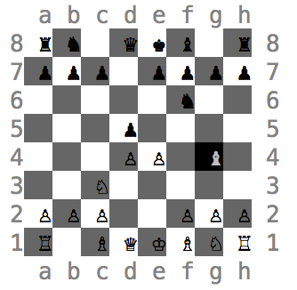
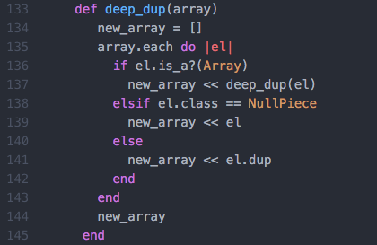
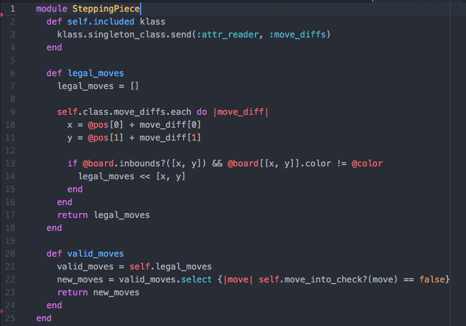

# Chess

## Background

This is an implementation of the classic game - Chess - using Ruby and object oriented programming. This is a game designed for two players, and the goal of the game is to checkmate the other player (placing his king in check and preventing it from making any valid moves).

## To start playing

* Navigate into main directory of program
* Run `bundle install` in console
* Run game.rb in console to load game
* Use arrow keys to navigate positions
* Press space to select piece, press space again to drop piece at new location

## Technical Details

* Enabled board to check whether the current player's move would place himself in check through implementing a recursive, deep-duplication algorithm.

* Kept code DRY through creating and recycling modules for pieces that share similar movement logic.

## To-dos/future features

* Implement min-max computer AI player
